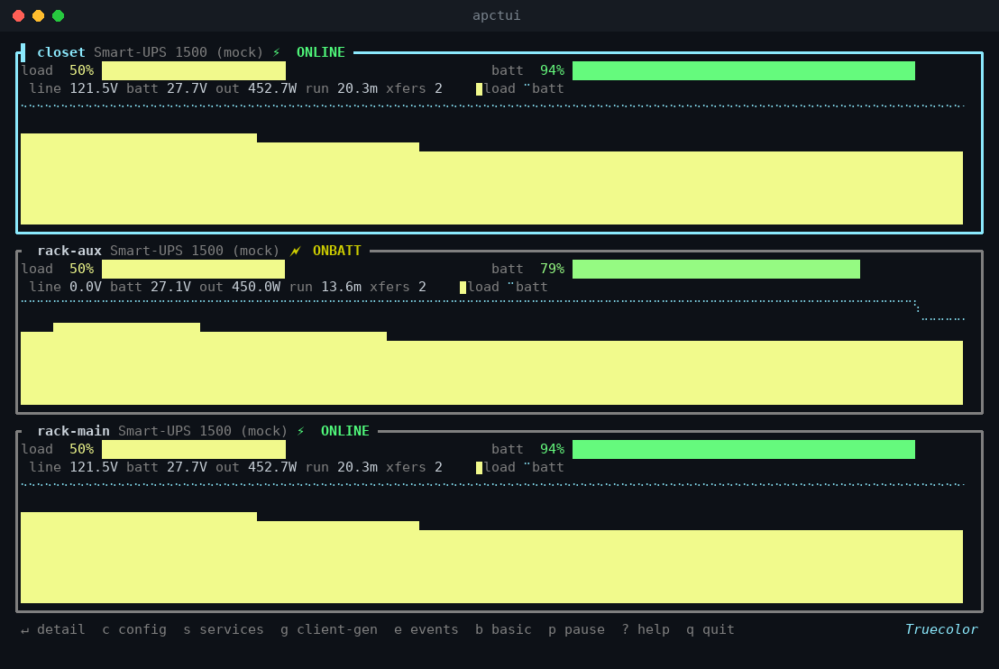
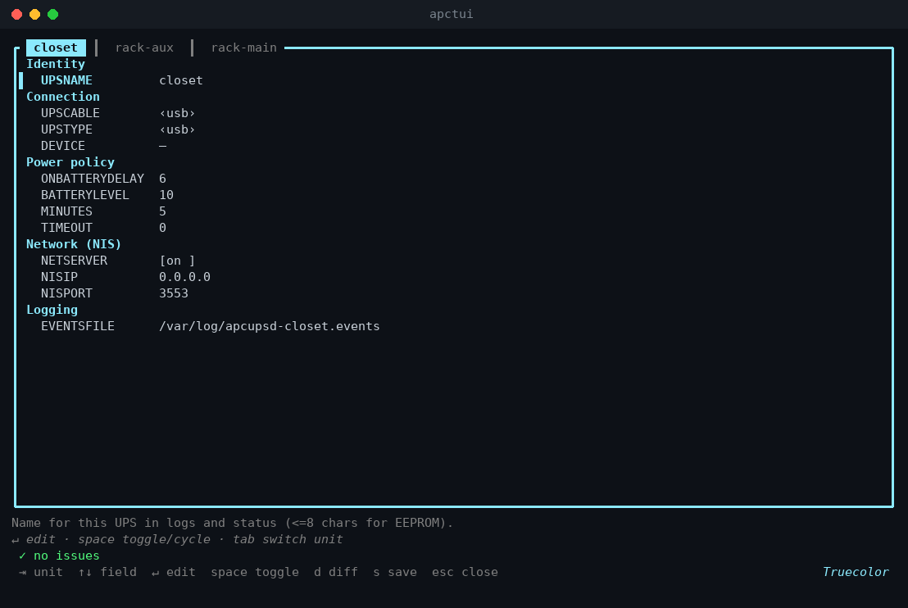
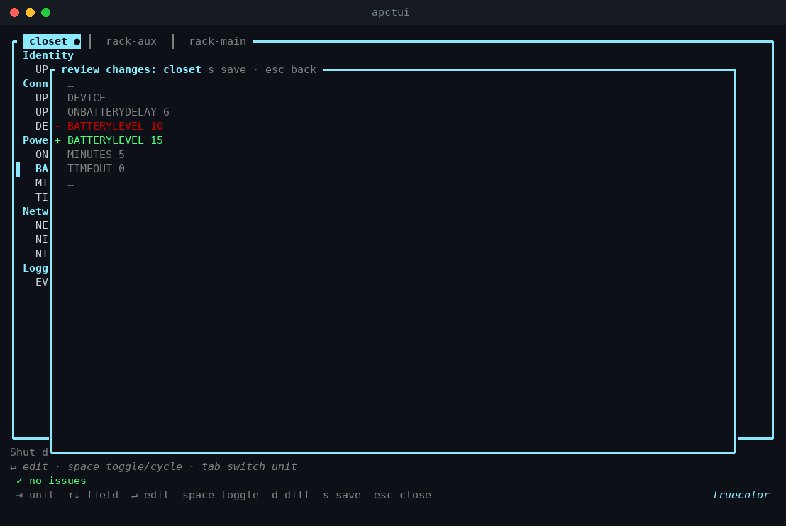
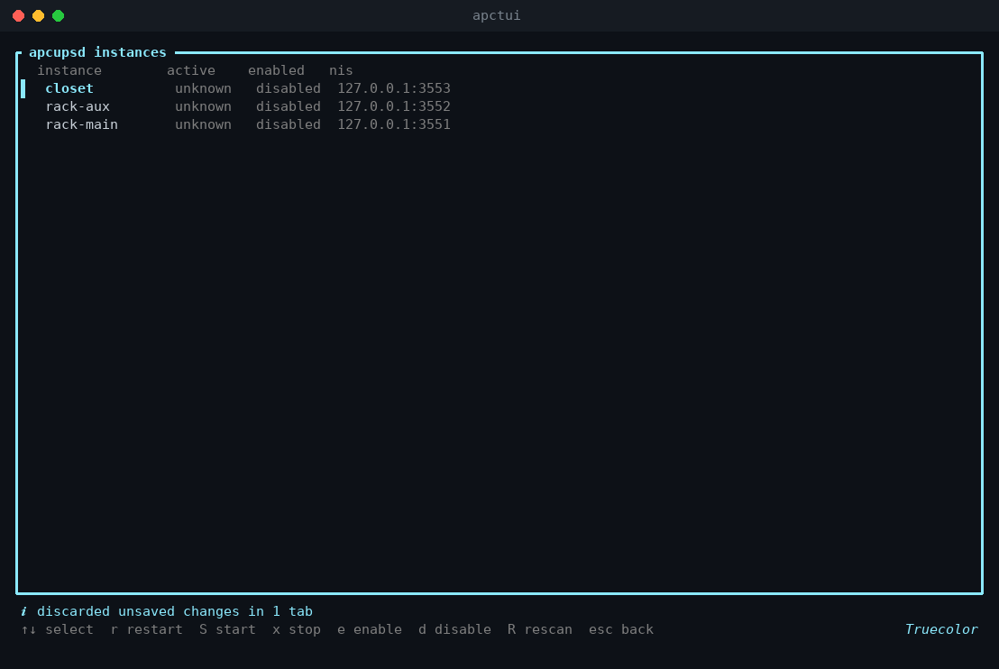
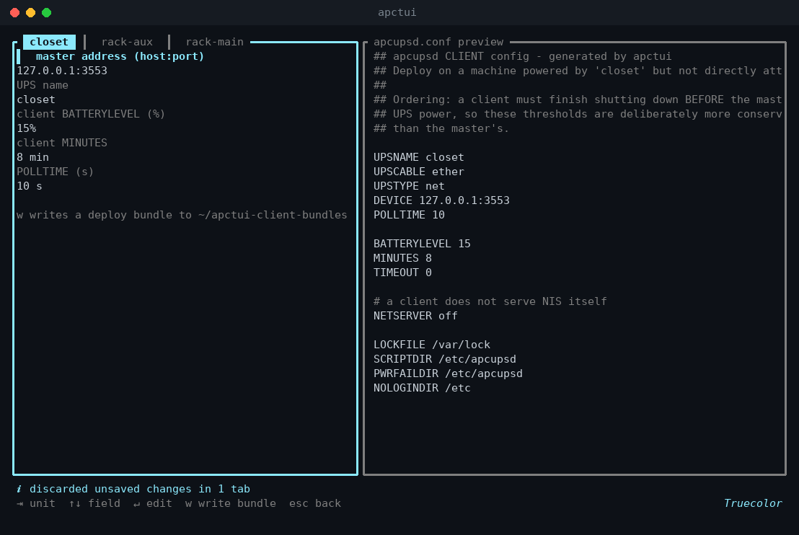
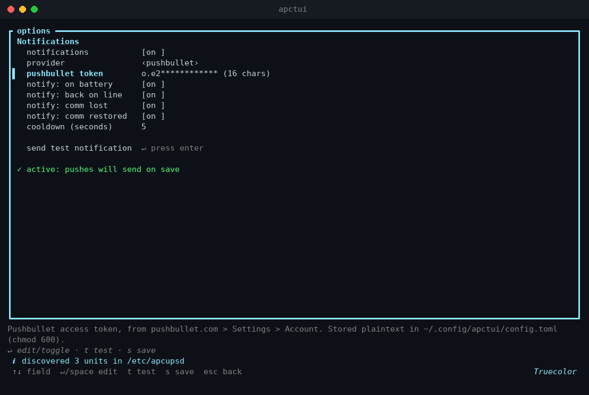
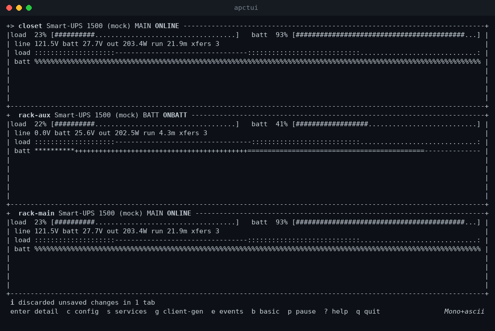

# apctui

A terminal UI that monitors and manages [apcupsd](http://www.apcupsd.org/) across
multiple APC UPS units. One screen for live status, config editing, service
control, and generating configs for networked clients.



Built in Rust with [ratatui](https://ratatui.rs/). GPL-3.0-or-later.

## The problem this solves

apcupsd runs **one daemon per UPS**. Nothing in the stock packaging tells you
this until you plug in a second unit and discover that the single
`apcupsd.service` autodetects whichever USB device enumerates first — and that
`hiddevN` numbering shuffles on reboot, so "whichever" changes.

Running several units properly means: instanced systemd units, one config per
UPS on its own NIS port, udev rules pinning each device by USB serial, and
making sure only the unit that actually powers the host can halt it. apctui's
installer does all of that, and the TUI gives you one place to watch and
manage the result.

## What's on screen

- One card per UPS: status, load and battery gauges, output watts, estimated
  runtime, transfer count.
- A rolling history chart per unit — load as bars, battery charge as a line —
  sampled every 2 seconds (`--interval` changes it). The bar color tracks
  load: green, then yellow, then red.
- `COMMLOST` in red when a daemon stops answering, with the connection error
  on the card. The dashboard keeps running; dead units don't take it down.
- When the terminal is too short for cards (four units on a small screen),
  it collapses to one line per UPS instead of clipping.

## Install

```sh
git clone https://github.com/b3p3k0/apctui.git
cd apctui
sudo ./install.sh
```

The installer builds the binary (as your user, with your toolchain — Rust
1.85+, and it offers to `apt install cargo` if you have nothing), then walks
the multi-instance setup: detects APC USB units by vendor ID, asks you to
name each one, writes udev rules keyed to each unit's serial number, generates
per-instance configs on NIS ports 3551 upward, asks which unit powers the
host, and enables the services.

Units that do *not* power the host get a no-op `doshutdown` event script
(exit 99 suppresses apccontrol's default halt) — so a low battery on the UPS
feeding your network rack logs an event instead of shutting down your server.

**Upgrading is re-running it.** `git pull && sudo ./install.sh` rebuilds,
reinstalls, refreshes the systemd unit and polkit policy, then offers to keep
your existing device setup untouched.

## Running it

```sh
apctui            # discovers every instance in /etc/apcupsd/*.conf
apctui --basic    # pure-ASCII output, no color
apctui --probe    # one-shot status dump to stdout, no TUI
```

With no flags, apctui scans `/etc/apcupsd/*.conf` and connects to each
instance's NIS endpoint. A startup banner tells you exactly where the unit
list came from, so a misconfigured setup is visible immediately instead of
silently showing the wrong thing. To monitor remote hosts, or to hide an
instance from the dashboard, use `~/.config/apctui/config.toml` — see
[examples/apctui.toml](examples/apctui.toml).

| Keys | |
|---|---|
| `j`/`k` | select unit · `↵` detail view |
| `c` | config editor |
| `s` | service control |
| `g` | client config generator |
| `o` | options (notifications) |
| `e` | event log · `b` ASCII mode · `p` pause · `q` quit |

## Editing configs without fear



`c` opens every instance's config in one editor — one tab per unit
(`Tab` to switch). Fields are typed: enums cycle, booleans toggle, integers
are range-checked. Validation runs on every change and knows apcupsd's actual
rules — `UPSTYPE net` without a `host:port` DEVICE is an error, all three
shutdown triggers disabled gets a warning, duplicate directives get flagged.

`s` saves. Before anything touches disk, you get a diff:



The parser round-trips your file **byte-exact**: comments, blank lines, odd
whitespace — all preserved. Only the directive you changed changes. If you've
hand-annotated your configs over the years, they stay annotated.

The save itself runs through a separate privileged helper (`pkexec`, sudo as
fallback): it re-validates as root, refuses to write a config with errors,
backs up the old file with a timestamp, writes atomically, and restarts the
daemon — restart, not reload, because apcupsd ignores SIGHUP. The TUI itself
never runs as root.

## Service control



Start, stop, restart, enable, disable — per instance, with a confirmation
step that spells out what stopping actually means (monitoring ends, shutdown
protection ends).

## Network clients



Machines powered by your UPSes but plugged into someone else's USB port can
run apcupsd in net-client mode against this host. `g` generates that config
per unit — with shutdown thresholds deliberately *more* conservative than the
master's, so clients finish shutting down before the master cuts power — and
writes a deploy bundle (config + install steps) to `~/apctui-client-bundles`.

The master address prefills with **this host's detected private IP**
(preferring 100.64/10, then 10/8, 172.16/12, 192.168/16 — overlay networks
like Tailscale win), because the loopback address apctui itself polls means
nothing to another machine. If no private address is found, the form warns
loudly instead of letting you export a config that can't work.

## Notifications



`o` opens app options. The first (currently only) option group is push
notifications via [Pushbullet](https://www.pushbullet.com/): paste your
access token, pick which events you care about, `t` to send a test push,
`s` to save.

What triggers a push — transitions only, never steady state:

- a unit switches to battery power (body includes load and estimated runtime)
- line power returns (body includes charge level)
- a unit stops answering — either the daemon going unreachable or a
  healthy daemon reporting `COMMLOST` (USB cable pulled). Both need
  **3 consecutive** bad polls, so one dropped packet doesn't page you at 3am
- a lost unit comes back

Every delivered push also confirms on screen as a toast, so you can tell
detection from delivery problems at a glance.

Run as many dashboards as you like — only **one instance per machine sends**
(a file lock under `~/.config/apctui/`). The header shows which: the sender
reads `notify on`, the rest `notify standby`. Close the sender and a standby
instance takes over within ~10 seconds. Two machines watching the same units
will still both send; the lock is per-machine, not per-fleet.
Repeat events for the same unit are rate-limited (default 60 s, configurable).
Delivery runs on a background thread; a dead network can't freeze the UI, and
failures show up as a toast with the HTTP status.

Settings persist to `~/.config/apctui/config.toml` under `[notifications]`.
Be aware: **the token is stored in plaintext**. apctui chmods the file to 600
on save, but it's your home directory — treat it accordingly. Saving rewrites
only the `[notifications]` section; hand-written `[[ups]]` entries and their
comments are preserved byte-for-byte.

## ASCII mode



`--basic`, the `b` key, `NO_COLOR`, or `TERM=dumb` gets you pure 7-bit ASCII —
for serial consoles, screen readers, or log capture. This is tested, not
aspirational: the test suite renders every view and fails if a single
non-ASCII byte appears.

## Sharp edges

- **NIS has no authentication.** It's read-only status, but anyone who can
  reach port 3551 can read it. The generated configs bind `0.0.0.0` so LAN
  clients work; firewall accordingly (the installer prints a ready-made
  `ufw` rule).
- **Serial pinning needs serials.** Some cheaper APC models ship with a blank
  USB serial number, which breaks per-unit udev pinning. Check with
  `udevadm info -a -n /dev/usb/hiddev0` before trusting a multi-unit setup.
- **Debian/Ubuntu only**, as far as the installer goes. The TUI itself just
  needs NIS endpoints and will monitor anything.
- A unit with `NETSERVER off` can't be monitored (no NIS to poll) — it shows
  in the services view but not the dashboard.

## Development

No UPS required:

```sh
cargo run --example mock_nis -- 3551 rack-main &
cargo run --example mock_nis -- 3552 rack-aux onbatt &   # cycles ONLINE/ONBATT/LOWBATT
cargo run -- --ups rack-main=127.0.0.1:3551 --ups rack-aux=127.0.0.1:3552
```

`cargo test` covers the NIS protocol, byte-exact config round-tripping,
validation rules, the diff engine, instance discovery, client-config
generation, editor key handling, and rendering of every view through
ratatui's TestBackend — including the ASCII-purity guarantee above.

## License

GPL-3.0-or-later. Full text in [LICENSE](LICENSE).
